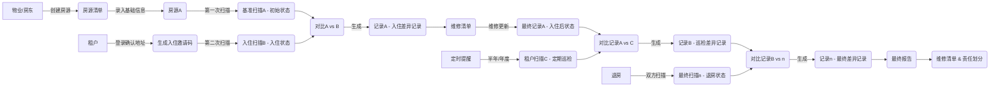

# SpeedInspect 房屋租赁巡检完整方案
## 一、业务流程总览
### 1.1 角色定义
| 角色 | 说明 | 权限 |
|------|------|------|
| **A角色 - 物业/房东** | 房屋所有者或管理者 | 房源管理、初始扫描、维修管理、报告查看、提醒配置 |
| **B角色 - 租户** | 房屋承租者 | 入住确认、定期巡检、退房检查、报告查看 |
### 1.2 全生命周期流程

## 二、功能模块详细拆分
### 📦 模块1：用户与权限系统
#### 1.1 角色权限体系
| 功能点 | 物业/房东 | 租户 | 管理员 |
|--------|----------|------|--------|
| 房源增删改查 | ✅ | ❌ | ✅ |
| 初始基准扫描 | ✅ | ❌ | ✅ |
| 邀请租户入住 | ✅ | ❌ | ✅ |
| 入住确认扫描 | ❌ | ✅ | ✅ |
| 定期巡检扫描 | ❌ | ✅ | ✅ |
| 退房联合扫描 | ✅ | ✅ | ✅ |
| 差异记录查看 | ✅ | ✅ | ✅ |
| 维修清单管理 | ✅ | ❌ | ✅ |
| 提醒配置 | ✅ | ❌ | ✅ |
| 报告导出 | ✅ | ✅ | ✅ |
| 系统设置 | ❌ | ❌ | ✅ |
#### 1.2 租户邀请流程
1. 房东创建房源后，生成唯一邀请码/邀请链接
2. 租户通过邀请码/链接注册/登录，自动关联到对应房源
3. 系统自动发送入住通知和操作指引
### 🏠 模块2：房源管理系统
#### 2.1 房源基础信息管理
| 字段 | 类型 | 说明 | 必填 |
|------|------|------|------|
| 房源ID | 字符串 | 唯一标识 | ✅ |
| 地址 | 字符串 | 完整地址 | ✅ |
| 房间号 | 字符串 | 如"3栋2单元1501" | ✅ |
| 房屋类型 | 枚举 | 公寓/别墅/商铺等 | ✅ |
| 面积 | 数字 | 建筑面积（平方米） | ❌ |
| 户型 | 字符串 | 如"3室2厅2卫" | ❌ |
| 装修情况 | 枚举 | 毛坯/简装/精装/豪装 | ❌ |
| 设施清单 | JSON | 家具家电列表 | ❌ |
| 房东ID | 字符串 | 关联用户表 | ✅ |
| 当前租户ID | 字符串 | 关联用户表 | ❌ |
| 租赁状态 | 枚举 | 空置/已出租/待租 | ✅ |
| 创建时间 | 日期 | | ✅ |
| 更新时间 | 日期 | | ✅ |
#### 2.2 房源生命周期管理
- 房源创建 → 待租状态
- 租户入住 → 已出租状态
- 租约到期 → 待租状态
- 房源删除 → 软删除，保留历史数据
### 📸 模块3：AI扫描与分析系统
#### 3.1 扫描类型定义
| 扫描类型 | 触发方 | 阶段 | 用途 |
|----------|--------|------|------|
| **基准扫描A** | 房东/物业 | 房源创建后 | 记录房屋初始状态，作为所有后续对比的基准 |
| **入住扫描B** | 租户 | 入住时 | 记录租户入住时的房屋状态，与基准对比得到初始差异 |
| **定期扫描C** | 租户 | 租赁期内（半年/年度） | 定期检查房屋状态，与上一次记录对比 |
| **退房扫描N** | 双方共同 | 退房时 | 记录退房时房屋状态，与最后一次记录对比得到最终差异 |
#### 3.2 扫描流程
```
1. 进入扫描页面 → 系统引导按区域扫描（客厅→卧室→厨房→卫生间→阳台）
2. 每个区域拍摄照片/视频 → 前端实时AI检测质量（清晰度、角度、完整性）
3. 扫描完成 → 自动上传到后端 → 提交AI分析任务
4. 异步分析完成 → 推送通知给用户
```
#### 3.3 AI核心能力
| 能力 | 说明 |
|------|------|
| **缺陷识别** | 自动识别15+类问题：墙面裂缝、水渍、霉斑、地板磨损、家具损坏、门窗问题、水电设施故障等 |
| **严重程度分级** | MINOR/LOW/MODERATE/HIGH/CRITICAL 五级分级 |
| **置信度评估** | 每个检测结果提供0-100%置信度评分 |
| **位置定位** | 自动识别问题所在房间和具体位置 |
| **费用估算** | 基于问题类型和严重程度，自动计算预估修复费用 |
### 🔍 模块4：差异对比系统
#### 4.1 对比算法
1. **空间对齐**：基于图像特征点匹配，对齐两次扫描的相同区域
2. **变化检测**：对比同一位置的图像差异，识别新增/消失/加重的问题
3. **语义匹配**：结合问题类型、位置、严重程度进行智能匹配
4. **人工审核**：低置信度的差异自动进入人工审核队列
#### 4.2 差异记录结构
| 字段 | 类型 | 说明 |
|------|------|------|
| 差异ID | 字符串 | 唯一标识 |
| 房源ID | 字符串 | 关联房源 |
| 扫描ID1 | 字符串 | 对比的第一个扫描版本 |
| 扫描ID2 | 字符串 | 对比的第二个扫描版本 |
| 问题描述 | 字符串 | 差异内容 |
| 位置 | 字符串 | 问题所在位置 |
| 严重程度 | 枚举 | 五级分级 |
| 置信度 | 数字 | 0-100% |
| 责任方 | 枚举 | 房东责任/租户责任/自然损耗/待确认 |
| 预估费用 | 数字 | 修复费用（元） |
| 状态 | 枚举 | 待确认/已确认/已维修/已忽略 |
| 证据图片 | 数组 | 对比前后的图片链接 |
| 创建时间 | 日期 | |
#### 4.3 对比结果展示
- 差异列表：按严重程度排序，展示所有识别到的差异
- 对比视图：滑动对比两次扫描的同一位置图片
- 统计概览：差异数量、总预估费用、责任方分布
### 📋 模块5：维修管理系统
#### 5.1 维修流程
```
差异确认 → 生成维修清单 → 分配维修任务 → 维修完成 → 上传维修凭证 → 更新差异状态 → 生成维修记录
```
#### 5.2 维修清单功能
- 批量导出维修单
- 维修任务分配（内部维修/第三方服务商）
- 维修进度跟踪
- 维修费用统计
- 维修凭证上传（照片、发票）
### ⏰ 模块6：提醒与通知系统
#### 6.1 提醒类型
| 提醒类型 | 触发条件 | 接收方 |
|----------|----------|--------|
| 入住提醒 | 租约开始前3天 | 房东+租户 |
| 定期巡检提醒 | 房东配置的巡检时间前7天、前1天 | 租户 |
| 巡检逾期提醒 | 超过巡检时间未完成 | 租户+房东 |
| 维修进度提醒 | 维修状态更新 | 房东+租户 |
| 退房提醒 | 租约到期前30天、前7天 | 房东+租户 |
| 报告生成提醒 | 对比报告生成完成 | 相关方 |
#### 6.2 通知渠道
- 站内消息
- 短信通知
- 邮件通知
- 微信/小程序通知（可选）
### 📄 模块7：报告生成系统
#### 7.1 报告类型
| 报告类型 | 生成时机 | 内容 |
|----------|----------|------|
| 入住报告 | 入住扫描完成对比后 | 房屋初始状态、入住差异、维修建议 |
| 定期巡检报告 | 定期扫描完成对比后 | 房屋状态变化、新增问题、维修建议 |
| 退房报告 | 退房扫描完成对比后 | 全租赁周期房屋状态变化、最终差异、责任划分、费用清算 |
| 年度汇总报告 | 每年年底 | 全年巡检情况、维修统计、房屋状态评估 |
#### 7.2 报告内容结构
1. 房屋基本信息
2. 扫描信息（时间、参与方）
3. 综合评分（0-100分）
4. 差异列表（按严重程度排序）
5. 责任划分明细
6. 维修清单与费用估算
7. 对比图片证据
8. 专业建议
#### 7.3 导出格式
- PDF（正式版，带水印）
- Excel（差异清单，可编辑）
- 图片（分享版，核心信息）
- 链接（在线查看，支持协作）
## 三、技术实现方案
### 3.1 后端模块调整
在现有后端架构基础上新增/调整以下模块：
```
backend/src/app/features/
├── properties/          # 新增：房源管理模块
├── scans/               # 新增：扫描管理模块
├── comparisons/         # 新增：差异对比模块
├── maintenance/         # 新增：维修管理模块
├── reminders/           # 新增：提醒通知模块
├── auth/                # 调整：支持多角色权限
├── users/               # 调整：用户角色扩展
├── ai/                  # 调整：新增对比分析能力
├── reports/             # 调整：支持多类型报告
└── ... 原有模块保持不变
```
### 3.2 核心API设计
| 模块 | 接口 | 方法 | 说明 |
|------|------|------|------|
| 房源 | `/api/v1/properties` | GET/POST/PUT/DELETE | 房源CRUD |
| 房源 | `/api/v1/properties/{id}/invite` | POST | 生成租户邀请码 |
| 扫描 | `/api/v1/scans` | GET/POST | 创建扫描任务，查询扫描列表 |
| 扫描 | `/api/v1/scans/{id}/upload` | POST | 上传扫描媒体文件 |
| 扫描 | `/api/v1/scans/{id}/status` | GET | 查询扫描分析状态 |
| 对比 | `/api/v1/comparisons` | POST | 提交两个扫描版本对比 |
| 对比 | `/api/v1/comparisons/{id}` | GET | 获取对比结果 |
| 维修 | `/api/v1/maintenance` | GET/POST/PUT | 维修清单管理 |
| 提醒 | `/api/v1/reminders` | GET/PUT | 查询和管理提醒 |
| 报告 | `/api/v1/reports/{id}/download` | GET | 下载报告 |
### 3.3 数据库新增表设计
```sql
-- 房源表
CREATE TABLE properties (
    id UUID PRIMARY KEY DEFAULT uuid_generate_v4(),
    address VARCHAR(255) NOT NULL,
    room_number VARCHAR(50) NOT NULL,
    property_type VARCHAR(50) NOT NULL,
    area FLOAT,
    layout VARCHAR(50),
    decoration_level VARCHAR(50),
    facilities JSONB,
    landlord_id UUID REFERENCES users(id) NOT NULL,
    current_tenant_id UUID REFERENCES users(id),
    status VARCHAR(50) NOT NULL DEFAULT 'vacant',
    created_at TIMESTAMP WITH TIME ZONE DEFAULT CURRENT_TIMESTAMP,
    updated_at TIMESTAMP WITH TIME ZONE DEFAULT CURRENT_TIMESTAMP
);
-- 扫描记录表
CREATE TABLE scans (
    id UUID PRIMARY KEY DEFAULT uuid_generate_v4(),
    property_id UUID REFERENCES properties(id) NOT NULL,
    scan_type VARCHAR(50) NOT NULL, -- baseline/occupancy/periodic/checkout
    operator_id UUID REFERENCES users(id) NOT NULL,
    status VARCHAR(50) NOT NULL DEFAULT 'pending', -- pending/processing/completed/failed
    media_files JSONB, -- 上传的文件列表
    ai_results JSONB, -- AI分析结果
    created_at TIMESTAMP WITH TIME ZONE DEFAULT CURRENT_TIMESTAMP,
    completed_at TIMESTAMP WITH TIME ZONE
);
-- 差异记录表
CREATE TABLE comparisons (
    id UUID PRIMARY KEY DEFAULT uuid_generate_v4(),
    property_id UUID REFERENCES properties(id) NOT NULL,
    scan_id_1 UUID REFERENCES scans(id) NOT NULL,
    scan_id_2 UUID REFERENCES scans(id) NOT NULL,
    differences JSONB NOT NULL, -- 差异列表
    status VARCHAR(50) NOT NULL DEFAULT 'pending', -- pending/confirmed/resolved
    total_estimated_cost FLOAT DEFAULT 0,
    created_at TIMESTAMP WITH TIME ZONE DEFAULT CURRENT_TIMESTAMP
);
-- 维修任务表
CREATE TABLE maintenance_tasks (
    id UUID PRIMARY KEY DEFAULT uuid_generate_v4(),
    property_id UUID REFERENCES properties(id) NOT NULL,
    comparison_id UUID REFERENCES comparisons(id),
    description TEXT NOT NULL,
    location VARCHAR(255),
    severity VARCHAR(50),
    estimated_cost FLOAT,
    actual_cost FLOAT,
    assignee VARCHAR(255),
    status VARCHAR(50) NOT NULL DEFAULT 'pending', -- pending/in_progress/completed/cancelled
    evidence JSONB, -- 维修凭证
    created_at TIMESTAMP WITH TIME ZONE DEFAULT CURRENT_TIMESTAMP,
    completed_at TIMESTAMP WITH TIME ZONE
);
-- 提醒配置表
CREATE TABLE reminders (
    id UUID PRIMARY KEY DEFAULT uuid_generate_v4(),
    property_id UUID REFERENCES properties(id) NOT NULL,
    reminder_type VARCHAR(50) NOT NULL, -- occupancy/periodic/checkout/maintenance
    remind_at TIMESTAMP WITH TIME ZONE NOT NULL,
    repeat_interval VARCHAR(50), -- 重复周期：none/daily/weekly/monthly/half_yearly/yearly
    recipients JSONB NOT NULL, -- 接收人列表
    status VARCHAR(50) NOT NULL DEFAULT 'pending', -- pending/sent/cancelled
    created_at TIMESTAMP WITH TIME ZONE DEFAULT CURRENT_TIMESTAMP
);
```
## 四、实施路线图
### Phase 1: 核心功能开发（3周）
| 周次 | 任务 | 交付物 |
|------|------|--------|
| 第1周 | 1. 用户角色权限扩展<br>2. 房源管理模块开发<br>3. 租户邀请流程实现 | 房源CRUD、邀请码生成、权限控制 |
| 第2周 | 1. 扫描功能开发<br>2. AI分析模块集成<br>3. 前端扫描页面开发 | 完整扫描流程、AI缺陷识别 |
| 第3周 | 1. 差异对比模块开发<br>2. 基础报告生成<br>3. 功能联调测试 | 扫描对比功能、基础报告导出 |
### Phase 2: 完整流程开发（2周）
| 周次 | 任务 | 交付物 |
|------|------|--------|
| 第4周 | 1. 维修管理模块开发<br>2. 提醒通知系统开发<br>3. 完整流程测试 | 维修全流程、多渠道通知 |
| 第5周 | 1. 退房流程开发<br>2. 多类型报告完善<br>3. 用户体验优化 | 租赁全生命周期流程闭环 |
### Phase 3: 上线与优化（1周）
| 周次 | 任务 | 交付物 |
|------|------|--------|
| 第6周 | 1. 性能优化<br>2. 安全加固<br>3. 灰度上线 | 生产环境可用版本 |
## 五、用户界面设计建议
### 5.1 房东端首页
- 房源概览卡片：总房源数、出租中、空置中
- 待办事项：待确认差异、待维修任务、即将到期租约
- 最近扫描记录列表
### 5.2 租户端首页
- 当前租赁房源信息卡片
- 待办事项：待完成扫描、待确认差异、即将到期提醒
- 历史扫描记录列表
### 5.3 扫描页面设计
- 区域引导：按房间分步扫描，显示当前扫描进度
- 实时反馈：拍摄后立即显示AI检测结果，不合格提示重拍
- 断点续传：支持中途退出，下次继续扫描
### 5.4 对比结果页面
- 差异概览：统计数据、严重程度分布
- 差异列表：卡片式展示，支持展开查看对比图片
- 一键确认：批量确认差异，生成维修清单
## 六、业务价值
### 6.1 对房东/物业的价值
- ✅ **减少纠纷**：客观记录房屋状态，避免退房时的责任争议
- ✅ **提高效率**：AI自动识别问题，减少人工巡检时间70%+
- ✅ **降低成本**：提前发现问题，避免小问题变成大维修
- ✅ **规范化管理**：全流程数字化记录，便于管理多套房源
### 6.2 对租户的价值
- ✅ **保障权益**：入住时明确房屋状态，避免退租时被讹诈
- ✅ **方便快捷**：手机拍照即可完成巡检，无需等待房东上门
- ✅ **透明公正**：AI客观评估，维修责任划分清晰
- ✅ **记录留存**：所有历史记录可查，保障自身权益
### 6.3 核心竞争优势
- 国内首个基于AI视觉的房屋租赁全生命周期巡检系统
- 支持多角色协作，房东租户数据互通
- 全流程自动化，无需人工介入
- 数据不可篡改，作为纠纷仲裁的客观依据
## 七、风险与应对
| 风险 | 影响 | 应对方案 |
|------|------|----------|
| AI识别准确率不足 | 差异识别错误，引发用户不满 | 1. 持续优化模型，行业数据训练 2. 低置信度结果人工审核 3. 允许用户手动标记差异 |
| 用户扫描不规范 | 图片质量差，影响对比结果 | 1. 前端实时引导，不合格照片提示重拍 2. 3D结构光引导扫描角度 3. 完整性校验，漏拍区域提示 |
| 数据安全风险 | 用户房屋信息泄露 | 1. 数据加密存储 2. 严格的权限控制 3. 符合隐私法规要求 |
| 用户接受度低 | 租户不愿意配合扫描 | 1. 简化操作流程，降低使用门槛 2. 明确告知租户数据用途，保障权益 3. 提供扫描指引和帮助 |
---
**文档位置**：`docs/房屋租赁巡检完整方案.md`
**更新记录**：
- 2026-03-15 初始版本创建，基于业务流程完整拆分功能模块
