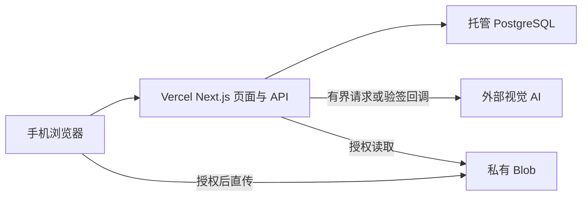

# SpeedInspect 技术方案：Vercel 统一部署

更新日期：2026-09-10。代码基线：`ed1887c`。本文描述目标架构，完整迁移尚未实现。2026-03 旧版保存在 [归档](archive/技术方案-202603.md)。

## 已确认约束与架构选择

用户确认：应用与接口只部署到 Vercel，允许使用托管数据库、对象存储和外部 AI API；日常开发在 `dev` 进行。

| 方案 | 优点 | 代价与结论 |
|---|---|---|
| Next.js 页面/API + 托管服务 | 单项目、同源鉴权、单一 API 契约 | 需要迁移 Python CRUD；推荐目标 |
| Next.js + Vercel FastAPI | 能复用部分 Python | 两套运行时和契约；仍需重做本地存储与任务；仅作过渡备选 |
| 浏览器本地模型与存储 | 云端依赖少 | 移动性能、模型能力、多用户和持久化受限；仅作离线研究 |

Vercel 支持 FastAPI，所以 Python 本身不是障碍；现有本地文件、SQLite、进程内任务和训练依赖才是生产障碍。首版调用外部视觉 AI，保留 Python 脚本用于离线研究，不在 Vercel 训练模型。

## MVP 范围

登录 → 创建巡检 → 按房间拍照或从短视频提取证据帧 → 私有上传 → AI 建议 → 人工确认和修改 → 版本化报告 → HTML/JSON 导出与浏览器打印。

视频抽帧在浏览器完成，并为不支持录制的设备提供照片上传入口。房源协作、租约、入住/退房配对、维修、通知、支付、咨询助手和模型训练均拆为后续阶段。旧方案中的“六周完成”“效率提升 70%”“行业首个”“全自动责任划分”“不可篡改”没有证据，不再作为验收承诺。

## 组件和数据流

- Web 负责采集、压缩、上传进度和人工复核；采集模块按需加载，默认不加载 TensorFlow 或训练依赖。
- 服务端负责会话、资源归属、schema、数据库和 AI 适配。前端使用同源 API，密钥不进入客户端。
- PostgreSQL 是唯一业务状态源，使用池化连接并选择靠近函数的区域。数据库迁移是独立发布步骤，不能在每个请求或 Preview 构建时修改生产库。
- Blob 默认私有。上传 token 必须绑定用户、inspectionId、允许 MIME、最大字节数和有效期。数据库记录 object key、哈希、MIME、大小和资源归属。
- AI 适配层保持供应商中立。现有通义配置可以作为候选，但模型选择必须基于获授权样本的中文效果、隐私、延迟、配额和价格验证。

## 持久化任务与恢复

1. 校验会话、媒体归属和上传完成状态，使用 `userId + idempotencyKey` 创建任务，返回 HTTP 202 和 `taskId`。
2. MVP 使用少量压缩图片的有界批次调用；AI 超时应低于函数时限，所有失败落库。浏览器关闭后能重新查询，不能依靠请求结束后的内存任务。
3. 状态机为 `queued → processing → succeeded | failed | cancelled`。记录 `attempt`、`leaseExpiresAt` 和稳定错误码，最多重试 3 次并指数退避。
4. 需要无人值守长任务时，再验证 Vercel 可用的托管工作流/队列或供应商异步回调。采用事务 + outbox 防止任务丢失；回调验签、防重放和幂等；补偿扫描恢复过期 lease。
5. 客户端有界轮询并支持取消。只有状态为 succeeded 且存在 `reportId` 时才加载报告。HTTP 下载进度不能用作推理进度。

## 目标数据模型

| 实体 | 关键字段 |
|---|---|
| User / Session | 身份、会话过期与撤销、角色 |
| Inspection | ownerId、房屋类型、房间、可选地址、状态 |
| MediaAsset | inspectionId、ownerId、blobKey、sha256、contentType、size、capturedAt、retentionUntil |
| AnalysisJob | ownerId、inspectionId、status、idempotencyKey、attempt、leaseExpiresAt、errorCode、model、promptVersion、reportId |
| Finding | assetId/时间点/框选、类别、建议严重度、描述、不确定性、人工决定 |
| ReportVersion / AuditEvent | 版本、hash、确认者、sourceJobId、操作记录 |

多角色阶段再加入资源 Membership。数据库外键和唯一约束保证完整性。JSON 日期统一为 ISO 8601，UUID 使用字符串，金额用整数分或明确范围；snake_case 与 camelCase 通过显式 adapter 转换。API 错误包含稳定的 `error.code`、用户可理解的 message 和 requestId。

## 安全、隐私与真实性

采用维护中的认证方案和服务端会话，使用 HttpOnly、Secure、SameSite Cookie；写操作校验 Origin/CSRF，并使用共享限流。middleware 看到 Cookie 存在不等于完成授权。

所有媒体、任务和报告操作必须校验归属，缺少 userId 时拒绝。拒绝任意远端 URL、路径穿越、SSRF、非法 MIME 和超限输入。模型响应执行 schema 校验和 HTML 转义，图片中的文字与指令均视为不可信数据。

AI 只描述可见迹象，不能仅凭图像判断结构安全、隐蔽水电故障、法律责任或赔偿。模型自报 confidence 不是校准概率；估价必须注明来源、地区、日期和参考范围。

报告保留原始模型建议、证据和人工修订版本。哈希用于一致性追踪，不代表法律意义上的不可篡改。室内媒体默认不公开；保留期在上线前确定，并实现数据库、Blob 和供应商数据的删除流程。

旧密码逻辑会截断 72 字节。迁移认证时须兼容验证旧 hash，并在成功登录后重哈希，或明确要求重置；不能静默导致旧账号失效。

## 质量、成本和发布门槛

建立获授权的标注集，按裂缝、水渍、霉斑等类别分别衡量 precision、recall、误报和无法判断率，覆盖不同光照、手机和房间。没有评测结果时不能声明准确率。

设置单次图片数、总字节、AI 调用数、每用户日配额、并发上限和费用熔断。成本由 AI 输入/输出或图片调用、Blob 存储与流量、数据库和 Vercel 计算构成；当前没有流量基数，不编造固定月费。

发布前需要验证双用户隔离、会话过期、上传超限、AI 429/超时/非法 JSON、弱网恢复、幂等、报告导出和备份恢复。当前缺陷与执行顺序见 [项目现状](PROJECT_STATUS.md) 和 [路线图](ROADMAP.md)。
